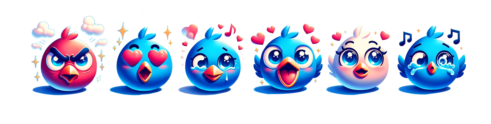

# Emotion classification and sentiment analysis
A deep learning project with comparative analysis of conventions deep learning models with transformer models

## Datasets

- [Tweets dataset](https://huggingface.co/datasets/dair-ai/emotion)
- [IMDB dataset](https://huggingface.co/datasets/dair-ai/emotion)

## Instructions on running the code
Each notebook has comprehensive instruction and can be easily executed on colab.
